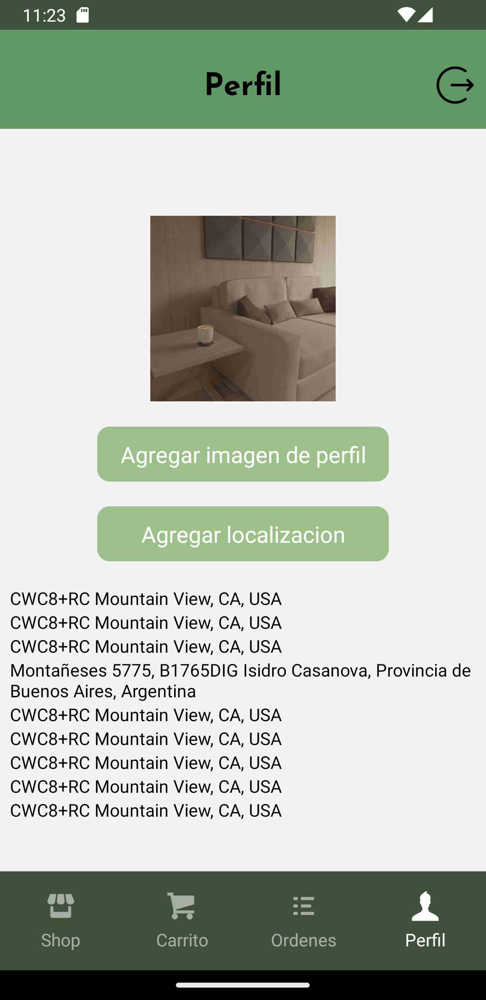

# E-Commerce App - React Native

Una aplicación de comercio electrónico desarrollada con React Native que ofrece una experiencia de compra completa y fácil de usar.

## Funcionalidades Principales

### Pantalla de Cuenta

- **Acceso seguro:** Solo los usuarios autenticados pueden acceder a la pantalla de perfil y realizar compras.
- **Información del usuario:** Muestra detalles del usuario, como nombre y dirección.




### Autenticación con Firebase

- Utiliza el sistema de autenticación de Firebase para gestionar el acceso de usuarios.
- Permite a los usuarios iniciar sesión y registrarse de manera segura.

### Pantalla de Categorías

- Muestra una selección de categorías en tarjetas.
- Al hacer clic en una categoría, se navega a la pantalla de productos correspondiente.

### Pantalla de Productos

- Lista todos los productos en tarjetas con nombre y foto.
- Incluye un buscador para filtrar productos por nombre.
- Al hacer clic en un producto, se navega a la pantalla de detalles del producto.

### Pantalla de Detalles del Producto

- Proporciona una descripción detallada del producto.
- Muestra el precio y el stock disponible.
- Permite agregar el producto al carrito.


### Navegación Inferior

```javascript 

   const TabNavigator = () => {
  return (
        <Tab.Navigator
          screenOptions={{
            headerShown:false,
            tabBarShowLabel:false,
            tabBarStyle: styles.tabBar

          }}
        >
          <Tab.Screen
             name="ShopStack"
             component={ShopStack}
             options={{
              tabBarIcon:({focused}) => <TabIcon icon="shop" label="Productos" focused={focused}/>
             }}
          />
          <Tab.Screen 
              name="CartStack" 
              component={CartStack}
              options={{
                tabBarIcon:({focused}) =>  <TabIcon icon="shopping-cart" label="Carrito" focused={focused}/> 
              }}
             />
             <Tab.Screen 
              name="OrdersStack" 
              component={OrdersStack}
              options={{
                tabBarIcon:({focused}) => <TabIcon icon="list" label="Ordenes" focused={focused}/> 
              }}
             />
            <Tab.Screen 
              name="ProfileStack" 
              component={ProfileStack}
              options={{
                tabBarIcon:({focused}) => <TabIcon icon="user" label="Perfil" focused={focused}/> 
              }}
             />
      </Tab.Navigator>
```

- **Pestaña 1 - Productos:** Categorías y productos (stack principal).
- **Pestaña 2 - Carrito:** Detalles del carrito de compras con resumen y botón para finalizar la orden.
- **Pestaña 3 - Órdenes:** Historial de órdenes realizadas.
- **Pestaña 4 - Perfil:** Información del usuario, ubicación y carga de imagen de perfil.

## Tecnologías Utilizadas

- **Firebase Authentication:** Implementa el sistema de autenticación de Firebase para gestionar la seguridad de la aplicación.
- **React Native Navigation Stack:** Gestiona la navegación entre pantallas.
- **React Native Navigation Buttom tap:** Gestiona la navegación entre pestañas.
- **Expo-Location:** Permite acceder y gestionar la ubicación del usuario.
- **Expo-Picker-Image:** Facilita la carga de imágenes de perfil.
- **Redux:** Centraliza y gestiona el estado de la aplicación.
- **RTK Query y Firebase:** Realiza operaciones de lectura/escritura en la base de datos.

## Instalación

1. Clona el repositorio: `git clone https://github.com/tu-usuario/tu-aplicacion.git`
2. Instala las dependencias: `npm install`
3. Configura las claves de API para servicios externos (Expo-Location, Firebase, etc.).
4. Configura las credenciales de Firebase en tu proyecto.
5. Ejecuta la aplicación: `npm start`

## Contacto

Para preguntas o soporte, contacta a maxi_rosanda@hotmail.com.